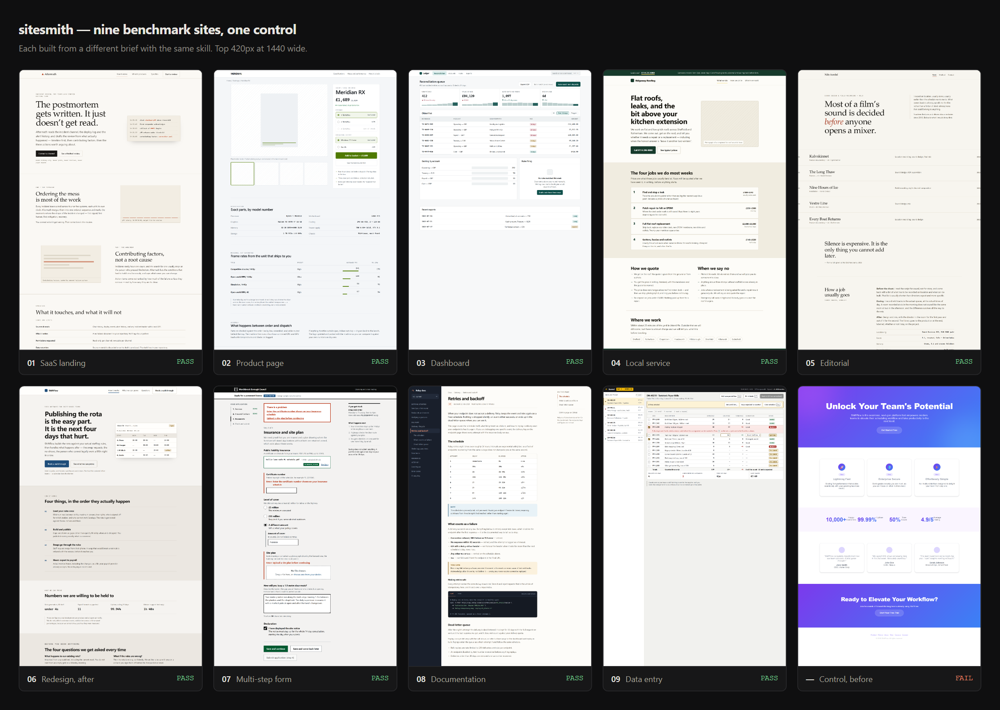

# sitesmith

**A coding-agent skill for building websites that don't look AI-generated.**

Most design skills are a list of rules. This one is a loop: it routes by what you're actually doing,
picks a direction before it picks colours, and then **renders the page and measures it** instead of
stopping when the code compiles.

> **Where this is.** The canonical layer is [`skills/sitesmith/v2/`](skills/sitesmith/v2/README.md):
> a definition of done, sixty core rules, three mode files, a design-system contract and a block
> library. It replaced a set of four vendored skills that carried 978 rules, 735 of them
> prohibitions.
>
> **v2 is not yet proven.** An isolated benchmark — three briefs, three runs with the skill and
> three without, blind-graded — is running now. Until it reports, the claim on this page is a
> claim. [Method.](benchmarks/v2/README.md)

### [→ Open the gallery](https://byensitmagnus.github.io/sitesmith/)



Nine sites built with v1 while a person consulted the skill, plus the control. They are **legacy**:
they show what the checks catch and the measurements taken from them are cited throughout, but nine
hand-built pages are not evidence that an agent produces better websites. That is what the v2
benchmark is for. [Method and raw reports.](benchmarks/README.md)

---

## The problem

Ask any coding agent for a landing page and you get the same page: a purple-to-blue gradient hero,
centred, two blurred orbs, three equal feature cards with emoji icons, "Unlock Your Potential", four
fabricated statistics and three testimonials from Jane Smith at Acme Corp. It scores well in a diff
and badly in a browser.

Three things cause it, and rule lists only fix the first:

1. **No direction was chosen.** The model reached for a default because nothing told it not to.
2. **The result was never looked at.** Contrast failures, mobile overflow and dead keyboard paths are
   invisible in source.
3. **Rules fire in the wrong context.** A dashboard doesn't want a cinematic hero; a portfolio doesn't
   want a settings panel.

## What sitesmith does about it

**Routes first.** New build, redesign, single component, audit, or product UI — each takes a
different path with different governing rules. Marketing pages are governed by three dials
(variance, motion, density). Product UI is governed by the UX rules. They don't mix.

**Commits to a direction before writing CSS.** One line, stated out loud: *"Reading this as: B2B SaaS
landing for technical buyers, with a Linear-style minimalist language, leaning toward Tailwind +
restrained motion."* Everything downstream follows from that sentence.

**Renders and measures.** A bundled Playwright script screenshots at 375/768/1440, runs axe in
**both** colour schemes, collects console errors, checks every link and detects horizontal overflow.
Step 11 of the build process is *look at the screenshots*.

**Treats anti-slop as judgement, not a ban list.** A purple gradient is slop when it's the accent
because no palette was chosen. It's correct when it's the brand. The skill distinguishes the two —
it will never reject your brand colour for being purple.

## What the loop caught

These were found in work that looked finished in the editor, while building the benchmarks:

| Defect | Why review missed it |
| --- | --- |
| +55px horizontal overflow at 375px | An inline `style="display:contents"` silently beat the `display:none` media query |
| Body text at 4.37:1 | Looks fine. Fails AA by 0.13 |
| White button label at 1.83:1 in dark mode | The light-mode value was hardcoded |
| Scrollable table unreachable by keyboard | Nothing visually wrong at any width |
| +250px overflow from a `1fr` grid track | `1fr` resolves its minimum to `auto`, so the track grew instead of the grid scrolling |
| Hidden labels escaping a scroll container | Absolutely positioned with no positioned ancestor, so each 1px label sat 615px into the document |

Fifteen real defects across eight sites, listed in full in the
[gallery](https://byensitmagnus.github.io/sitesmith/#caught). Every one ships if the process stops
at "the code compiles".

## Results

**What is measured, and what is not.**

The nine v1 builds pass the technical floor and the control does not:

| | Console | Broken links | Axe serious | Mobile overflow | Lighthouse a11y |
| --- | --- | --- | --- | --- | --- |
| Nine v1 builds | 0 | 0 | 0 | 0 | 100 (six measured) |
| Control (no skill) | 0 | 8 | 2 | 1 | 81 |

That is a real result about a real checker, and it is **not** a result about the skill: a person
wrote those nine pages while reading the rules. The control was written to be bad.

The v2 benchmark answers the actual question — does an agent handed a brief produce a better
website with this than without it — with eighteen isolated runs, blind grading and every run
published including the bad ones. [Method, and the four weaknesses of the
design.](benchmarks/v2/README.md) It has not reported yet.

## Install

**Claude Code**

```bash
claude plugin marketplace add byensitmagnus/sitesmith
claude plugin install sitesmith@sitesmith
```

**Any agent that reads `~/.claude/skills` or `~/.agents/skills`** (Codex, Grok, Cursor and others)

```bash
git clone https://github.com/byensitmagnus/sitesmith.git
cp -r sitesmith/skills/sitesmith ~/.claude/skills/
```

**Optional — the verification script**

```bash
npm i -D playwright @axe-core/playwright && npx playwright install chromium
```

Without it the skill still works; steps 10–11 become a manual browser check. Without Python 3.10+
the palette search degrades to choosing by hand from the reference files.

## Use it

Just ask. The skill triggers on its own.

```
Build a landing page for a company that does flat-roof repair in Sheffield.
```
```
This dashboard looks generic. Audit it and fix what you find.
```
```
Redesign this page, but keep the framework and the brand colours.
```
```
Build a pricing table. Three tiers, one recommended.
```

## What's inside

```
skills/sitesmith/
  SKILL.md                  routing, the build loop, precedence, anti-slop
  v2/                       THE CANONICAL LAYER — the only thing read during a build
    00-done.md              fourteen things a finished website has
    10-core.md              sixty rules that hold in every mode
    modes/                  marketing · e-commerce · product UI, one answer each
    30-contract.md          the design-system contract, derived from the brief
  blocks/                   22 composition patterns, tokens only, variants and metadata
  references/               v1 upstream, kept for attribution. NOT read during a build
  data/                     28 CSV datasets — 161 palettes, 73 font pairings, 84 styles
  scripts/
    search.py               query the datasets
    verify.mjs              3 widths, axe both schemes, links, console, overflow,
                            document structure, --font-stress
    token-drift.mjs         values used that the contract never declared
benchmarks/                 v1: nine sites and the control. Legacy, kept for the measurements
  v2/                       the isolated benchmark: briefs, runs, rubric, results
index.html                  the gallery, published to GitHub Pages
tools/                      repo self-checks, conformance ratchet, benchmark harness
```

`SKILL.md` stays under 500 lines on purpose, and sixty core rules plus one mode file is what an
agent holds while working. `references/` is provenance, not authority — the reasoning is in
[`docs/v2/`](docs/v2/CONFLICTS.md).

## Credit

sitesmith v1 was a composition of four openly licensed projects, credited in
[NOTICE.md](NOTICE.md). v2 is written here and descends from them: their material is kept in
`references/` for attribution, and every file says whether it is still verbatim or was modified,
with a note saying what changed.

- **[taste-skill](https://github.com/Leonxlnx/taste-skill)** (MIT) — brief inference, dials, AI tells, motion, blocks
- **[ui-ux-pro-max-skill](https://github.com/nextlevelbuilder/ui-ux-pro-max-skill)** (MIT) — the datasets, the search engine, the UX rules
- **[frontend-design](https://github.com/anthropics/claude-plugins-official)** (Apache 2.0, Anthropic) — aesthetic ambition
- **[impeccable](https://github.com/pbakaus/impeccable)** (Apache 2.0) — the command vocabulary

If sitesmith is useful, those four are why. Star them too.

Two further sources were evaluated and **rejected** as non-redistributable — one had no license, one
had no traceable author. Their material was replaced with originally written equivalents. The
reasoning is in [LICENSE-AUDIT.md](LICENSE-AUDIT.md).

Original to this repo, MIT: `SKILL.md`, all of `v2/`, all of `blocks/`, `06-redesign-audit.md`,
`10-setup.md`, `verify.mjs`, `token-drift.mjs`, `tools/`, the benchmarks and the docs.

**Where the four are still ahead.** Worth saying on the front page rather than in a footnote:
impeccable has the more mature product — a CLI installer, live browser iteration, hooks that fire
while you edit, and a concept-selection flow that generates several directions before choosing one.
taste-skill has image-first workflows and a brandkit that starts from meaning. frontend-design is
the sharpest single statement about taking one reasoned aesthetic risk. ui-ux-pro-max has the
larger, better-maintained dataset. sitesmith's strengths are verification and cross-page
consistency; it is not yet their equal at forming a visual direction.

## Contributing

[CONTRIBUTING.md](CONTRIBUTING.md). The short version: a rule that can't be demonstrated on a
rendered page doesn't belong in the skill.

## License

[MIT](LICENSE) for our own work; bundled material keeps its original license. See
[NOTICE.md](NOTICE.md).
