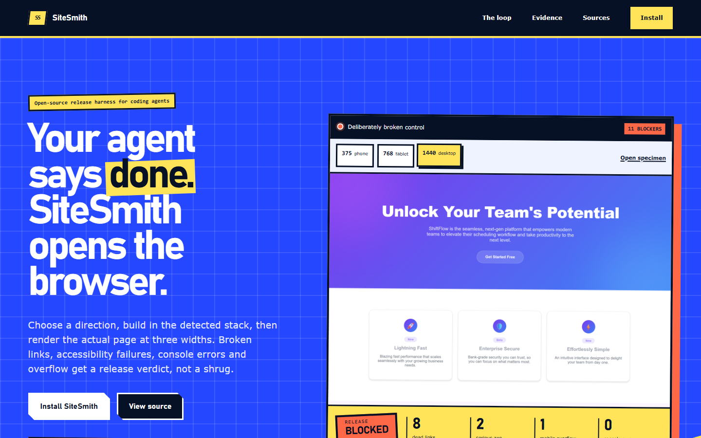

# SiteSmith

**A browser release loop for coding agents that build websites.**

SiteSmith is a website-building skill for coding agents. It chooses a visual direction, builds in
the detected stack, and checks the result in a real browser before it calls the site done. The
ordinary workflow is three commands: `init → build → audit`.

**[Open the live project page](https://byensitmagnus.github.io/sitesmith/)** ·
**[Install SiteSmith](#install)** ·
**[Why the showcase was reset](docs/v2/preflight/round-8/RESULT.md)**



> **Where this is.** The canonical layer is [`skills/sitesmith/v2/`](skills/sitesmith/v2/README.md):
> a definition of done, sixty core rules, three mode files, a design-system contract and a block
> library. It replaced a set of four vendored skills that carried 978 rules, 735 of them
> prohibitions.
>
> **Product status.** V2 is pre-release on `main`. The benchmark lab is separate and never runs
> during a customer-site build.
>
> **Evidence boundary.** SiteSmith's browser checks catch accessibility, links, console and
> overflow defects. Round 8's three pages averaged 8.21 in individual review, but the set failed
> portfolio diversity. SiteSmith does not claim that it measurably improves an arbitrary agent.

## Showcase reset: 0/8

The three Round 8 pages cleared the individual score threshold. They still looked like one studio
using one recipe. The rendered set failed on five shared devices: warm light grounds, uppercase mono
labels, hairline separators, tabular figures and no elevation. Both assignment-blinded reviewers
independently reached the same portfolio finding.

They remain committed as benchmark evidence, but none is presented as showcase work. The public
manifest now requires both an individual pass and a rendered portfolio-diversity pass, and CI checks
that the website tells the same truth. [Raw diversity report](docs/v2/preflight/round-8/diversity/portfolio.json)
· [reviews and correction](docs/v2/preflight/round-8/RESULT.md) ·
[public manifest](gallery/showcase.json)

---

## The problem

Ask any coding agent for a landing page and you get the same page: a purple-to-blue gradient hero,
centred, two blurred orbs, three equal feature cards with emoji icons, "Unlock Your Potential", four
fabricated statistics and three testimonials from Jane Smith at Acme Corp. It scores well in a diff
and badly in a browser.

Three things cause it, and rule lists only fix the first:

1. **No direction was chosen.** The model reached for a default because nothing told it not to.
2. **The result was never looked at.** Contrast failures, mobile overflow and dead keyboard paths are
   invisible in source.
3. **Rules fire in the wrong context.** A dashboard doesn't want a cinematic hero; a portfolio doesn't
   want a settings panel.

## What sitesmith does about it

**Routes first.** New build, redesign, single component, audit, or product UI — each takes a
different path with different governing rules. Next.js, React/Vite and Astro are detected from the
project and bound to one matching adapter instead of receiving generic framework advice.

**Makes variation visible.** Density, motion and aesthetic boldness are recorded as justified
1–10 values in the brief and direction. They alter candidate ranking, so a quiet public service
and a kinetic campaign do not begin from the same hidden house style.

**Commits to a direction before writing CSS.** One line, stated out loud: *"Reading this as: B2B SaaS
landing for technical buyers, with a Linear-style minimalist language, leaning toward Tailwind +
restrained motion."* Everything downstream follows from that sentence.

**Makes the small style choices explicit.** Every direction also chooses its surface, label,
figure and depth grammar. A shared local ledger measures finished renders across projects, and
the exact flat technical-editorial recipe that made three unrelated builds look alike now fails
even before the ledger has an entry.

**Renders and measures.** A bundled Playwright script screenshots at 375/768/1440, runs axe in
**both** colour schemes, collects console errors, checks every link and detects horizontal overflow.
The audit is incomplete until someone opens those screenshots and writes a specific criticism.

**Treats anti-slop as judgement, not a ban list.** A purple gradient is slop when it's the accent
because no palette was chosen. It's correct when it's the brand. The skill distinguishes the two —
it will never reject your brand colour for being purple.

## What the loop caught

These were found in work that looked finished in the editor, while building the benchmarks:

| Defect | Why review missed it |
| --- | --- |
| +55px horizontal overflow at 375px | An inline `style="display:contents"` silently beat the `display:none` media query |
| Body text at 4.37:1 | Looks fine. Fails AA by 0.13 |
| White button label at 1.83:1 in dark mode | The light-mode value was hardcoded |
| Scrollable table unreachable by keyboard | Nothing visually wrong at any width |
| +250px overflow from a `1fr` grid track | `1fr` resolves its minimum to `auto`, so the track grew instead of the grid scrolling |
| Hidden labels escaping a scroll container | Absolutely positioned with no positioned ancestor, so each 1px label sat 615px into the document |

Fifteen real defects across eight sites are listed in the
[legacy benchmark report](benchmarks/README.md#what-the-loop-actually-caught). Every one ships if
the process stops at "the code compiles".

## Results

**What is measured, and what is not.**

The nine v1 builds pass the technical floor and the control does not:

| | Console | Broken links | Axe serious | Mobile overflow | Lighthouse a11y |
| --- | --- | --- | --- | --- | --- |
| Nine v1 builds | 0 | 0 | 0 | 0 | 100 (six measured) |
| Control (no skill) | 0 | 8 | 2 | 1 | 81 |

That is a real result about a real checker, and it is **not** a result about the skill: a person
wrote those nine pages while reading the rules. The control was written to be bad.

The proposed eighteen-run skill-versus-control study was retired before generation. Its design is
kept as historical methodology, not a pending promise. No transfer claim is made.

## Install

**Claude Code**

```bash
claude plugin marketplace add byensitmagnus/sitesmith
claude plugin install sitesmith@sitesmith
```

**Claude, Codex and Cursor provider packs from one canonical pipeline**

```bash
git clone https://github.com/byensitmagnus/sitesmith.git
node sitesmith/bin/sitesmith.mjs install --to . --provider all
```

The installer copies the skill, generates each provider entry point from `PIPELINE.json`, installs
the pinned Playwright/axe dependencies and runs `doctor`. To install only the prose skill, use
`--no-deps`; canonical verification then fails closed until the dependencies exist.

## Use it

```bash
init
build
audit
```

Or just ask normally; the skill routes the request itself.

```
Build a landing page for a company that does flat-roof repair in Sheffield.
```
```
This dashboard looks generic. Audit it and fix what you find.
```
```
Redesign this page, but keep the framework and the brand colours.
```
```
Build a pricing table. Three tiers, one recommended.
```

## What's inside

```
skills/sitesmith/
  SKILL.md                  routing, the build loop, precedence, anti-slop
  v2/                       THE CANONICAL LAYER — the only thing read during a build
    00-done.md              fourteen things a finished website has
    10-core.md              sixty rules that hold in every mode
    modes/                  marketing · e-commerce · product UI, one answer each
    30-contract.md          the design-system contract, derived from the brief
  blocks/                   22 composition patterns, tokens only, variants and metadata
  references/               v1 upstream, kept for attribution. NOT read during a build
  data/                     28 CSV datasets — 161 palettes, 73 font pairings, 84 styles
  scripts/
    stack-router.mjs        detect Next.js, React/Vite or Astro and bind one adapter
    direction-history.mjs   reject known/repeated render recipes across projects
    search.py               query the datasets; dials alter candidate formation
    verify.mjs              3 widths, axe both schemes, links, console, overflow,
                            document structure, --font-stress
    token-drift.mjs         values used that the contract never declared
benchmarks/                 v1: nine sites and the control. Legacy, kept for the measurements
  v2/                       the isolated benchmark: briefs, runs, rubric, results
docs/v2/preflight/          historical review lab, never part of a normal website build
index.html                  the project page, published to GitHub Pages
tools/                      repo self-checks, conformance ratchet, benchmark harness
```

`SKILL.md` stays under 500 lines on purpose, and sixty core rules plus one mode file is what an
agent holds while working. `references/` is provenance, not authority — the reasoning is in
[`docs/v2/`](docs/v2/CONFLICTS.md).

## Credit

sitesmith v1 was a composition of four openly licensed projects, credited in
[NOTICE.md](NOTICE.md). v2 is written here and descends from them: their material is kept in
`references/` for attribution, and every file says whether it is still verbatim or was modified,
with a note saying what changed.

- **[taste-skill](https://github.com/Leonxlnx/taste-skill)** (MIT) — brief inference, dials, AI tells, motion, blocks
- **[ui-ux-pro-max-skill](https://github.com/nextlevelbuilder/ui-ux-pro-max-skill)** (MIT) — the datasets, the search engine, the UX rules
- **[frontend-design](https://github.com/anthropics/claude-plugins-official)** (Apache 2.0, Anthropic) — aesthetic ambition
- **[impeccable](https://github.com/pbakaus/impeccable)** (Apache 2.0) — the command vocabulary

If sitesmith is useful, those four are why. Star them too.

Two further sources were evaluated and **rejected** as non-redistributable — one had no license, one
had no traceable author. Their material was replaced with originally written equivalents. The
reasoning is in [LICENSE-AUDIT.md](LICENSE-AUDIT.md).

Original to this repo, MIT: `SKILL.md`, all of `v2/`, all of `blocks/`, `06-redesign-audit.md`,
`10-setup.md`, `verify.mjs`, `token-drift.mjs`, `tools/`, the benchmarks and the docs.

**Where the four are still ahead.** Impeccable has live browser iteration and framework hooks that
SiteSmith deliberately has not copied. Taste-skill still has the broader image-first workflow.
Frontend-design remains the sharpest short statement of aesthetic ambition, and ui-ux-pro-max is
the upstream maintainer of the datasets. SiteSmith's distinct product is the combined, auditable
loop: evidence, visible variation, stack-aware implementation and rendered release proof.

## Contributing

[CONTRIBUTING.md](CONTRIBUTING.md). The short version: a rule that can't be demonstrated on a
rendered page doesn't belong in the skill.

## License

[MIT](LICENSE) for our own work; bundled material keeps its original license. See
[NOTICE.md](NOTICE.md).
