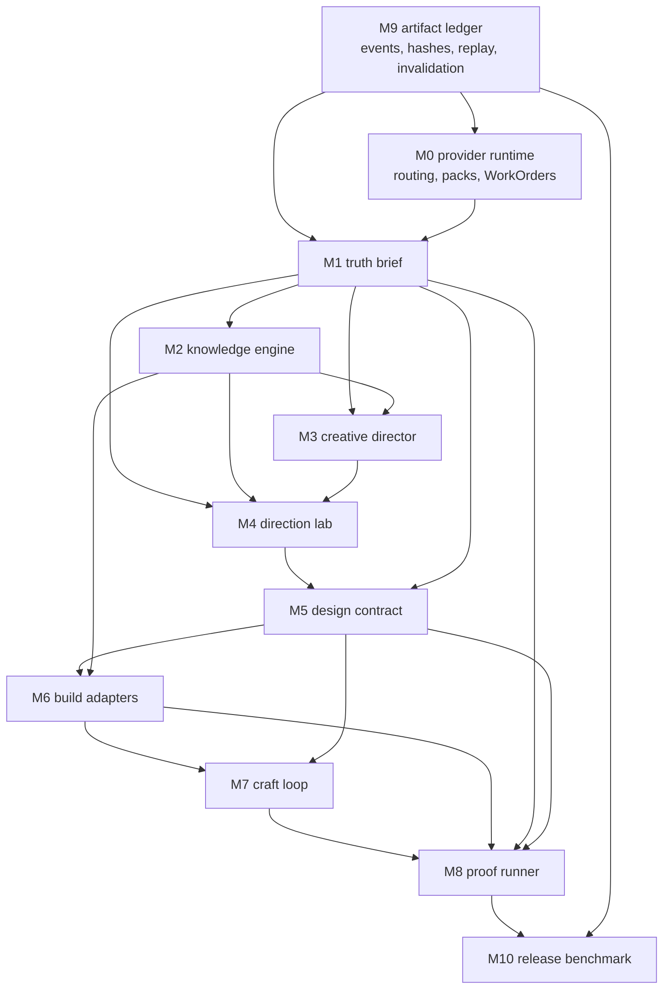
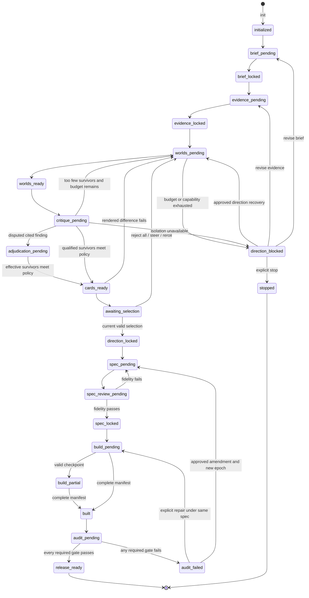

# SiteSmith v3 derivation architecture

## 1. Decision status and derivation basis

This document proposes the decision-ready v3 architecture. It does **not** authorise implementation,
migration, a website build, a benchmark, a release, a merge, a push, or a quality claim.

The proposal is derived from the [foundation decision](./FOUNDATION-DECISION.md), the frozen
[upstream forensics](./UPSTREAM-FORENSICS.md), the 59-record
[capability ledger](./UPSTREAM-CAPABILITY-LEDGER.json), the binding
[capability supremacy matrix](./CAPABILITY-SUPREMACY-MATRIX.md), and the
[licence and derivation audit](./LICENSE-DERIVATION-AUDIT.md). If this document conflicts with a
capability assignment in the matrix, the matrix wins until both documents are changed by an explicit
architecture decision.

The architecture has eleven binding module identities, `M0` through `M10`. Their numbers are stable
identifiers, not implementation order. Every material upstream capability is **assigned** to exactly
one module below. For a non-rejected capability, assignment carries its validated strength or an
explicitly recorded successor outcome without requiring copied source mechanism. For a rejected
capability, assignment owns only the exclusion, negative fixture and deliberate-loss record; it does
not carry the rejected strength or earn non-inferiority.

A clean-room reimplementation has two independent obligations: positive successor proof for the
retained observable outcome and a separate negative fixture proving the old source mechanism is
absent. Passing either one cannot compensate for the other, and implementers receive the outcome
contract and fixtures rather than upstream code, data expression, or prompt expression.

“SiteSmith-specific value” below means the product composition and contract SiteSmith will own. It is
not a patent, novelty, originality, visual-quality, or superiority claim. In particular, the proposed
**DecisionProofGraph** is an architecture hypothesis until the
[Quality Contract](./QUALITY-CONTRACT.md) is executed and all applicable QC gates pass with recorded
evidence.

The approval decision is therefore narrow:

| Decision | Proposed ruling |
| --- | --- |
| Product boundary | A local deterministic workflow core with typed work delegated to a declared local or network provider when model-owned judgement/code is required, plus proof-bearing outputs. |
| User surface | `init` → `build` → `audit`, with five targeted commands and no mandatory live service. |
| Creative decision | Evidence-linked, structurally different directions are adjudicated before a binding DesignSpec exists. |
| Integration | No submodules; pinned, manifested adapters or original capability-compatible logic only. |
| Claims | No implementation, release, quality, or upstream-superiority claim follows from architecture approval. |

## 2. Product surface and command contract

The default path must remain understandable without knowledge of modules, providers, prompts, or
artifact internals:

```text
sitesmith init  →  sitesmith build  →  sitesmith audit
```

| Command | User intent | Durable result | Boundary |
| --- | --- | --- | --- |
| `sitesmith init` | Establish the product truth and a safe run baseline. | `RunConfig`, project baseline, `Brief`, truth artifacts, provider/stack capability report, and the exact next disposition. | May inspect the declared workspace; it cannot write product code or silently resolve material unknowns. |
| `sitesmith build` | Move from locked truth through direction choice, locked DesignSpec, and one supported build. | Direction decision, `DesignSpec`, checkpoints, and `BuildManifest`; it pauses at user selection or any blocker. | Cannot select a hidden winner, average rejected directions, amend the spec silently, or call a partial build complete. |
| `sitesmith audit` | Prove the built result against truth, spec, journeys, browser behaviour, accessibility, and release policy. | `AuditReport`, `FidelityReport`, `ProofBundle`, and either `release_ready` or `audit_failed`. | Cannot redesign, auto-waive, hide, or auto-remediate a required failure. |
| `sitesmith shape` | Resolve an unclear brief, feature, surface, or direction before implementation. | A new truth/direction/spec revision, or an explicit unresolved decision. | Stops before code; a material change increments the epoch and invalidates descendants. |
| `sitesmith critique` | Request evidence-linked semantic and deterministic review at a named boundary. | Immutable `CritiqueReport`, `ReviewPanelReport`, or `AdjudicationRequest`. | Read-only against the reviewed artifact; a same-context opinion cannot become an independent hard pass. |
| `sitesmith polish` | Improve craft inside an already locked DesignSpec. | A scoped build revision plus craft findings and re-run obligations. | Cannot change the thesis, signature, assets, palette roles, topology, or primary interaction. |
| `sitesmith harden` | Run robustness and release-critical checks without aesthetic drift. | Updated mechanical reports and a release matrix. | Cannot convert a failure to a pass without new evidence or an explicit, policy-valid waiver. |
| `sitesmith doctor` | Diagnose install, provider, schema, ownership, state-chain, and tool availability. | `DoctorReport` and typed repair options. | Read-only by default; repair requires an explicit command and transactional rollback. |

`live` is not a core v3 command. The Impeccable tight-feedback outcome is deliberately **not carried**
or claimed non-inferior in v3 core. A demand-proven live visual loop may later exist as an isolated,
versioned plugin with a separate security decision, signed session protocol, content-security policy,
safe framework-specific appliers, fuzzing, and crash-recovery proof. Its absence must never weaken the
local `build`, `critique`, `polish`, or browser-proof paths, but those paths are not described as a
replacement for Live.

## 3. DecisionProofGraph hypothesis

The DecisionProofGraph is the proposed SiteSmith-specific composition that keeps creative judgement
visible without pretending it is deterministic. It links what is known, what alternatives were
considered, what was chosen, what was built, and what was actually proved.

```mermaid
flowchart LR
    E["Locked evidence<br/>truth, claims, brand, assets, journeys"] --> W["Structurally different VisualWorlds<br/>externally assigned lenses"]
    W --> C["Isolated critique<br/>eligibility + cited findings"]
    C --> A["Adjudication when disputed<br/>human or fresh isolated actor"]
    C --> D["Equal anonymous DirectionCards<br/>typed + rendered difference"]
    A --> D
    D -->|"choose"| L["Locked direction<br/>world hash + card-spec hash"]
    D -->|"reject all / steer / reroll"| W
    L --> S["Locked DesignSpec<br/>field-level provenance"]
    S --> B["Supported build<br/>isolated workspace + checkpoints"]
    B --> F["Continuous detectors and craft review<br/>no silent redesign"]
    F --> P["Browser and journey proof<br/>mechanical + fidelity evidence"]
    P --> R["Release decision<br/>all required gates green"]
```



The graph uses typed, directional edges rather than narrative hand-offs:

| Edge | Meaning |
| --- | --- |
| `derivedFrom` | Output was produced from exact input envelope hashes under named policy/provider versions. |
| `qualifiedBy` | A deterministic or isolated semantic result affected eligibility without mutating the reviewed artifact. |
| `selectedFrom` | A current, stale-safe user or declared evaluator command chose one exact card set member. |
| `compiledTo` | A selected world and its render-complete CardSpec became a traceable DesignSpec. |
| `implementedBy` | A build manifest names the exact spec, workspace baseline, patches, commands, and resulting tree. |
| `observedBy` | A detector or reviewer produced a finding against an immutable target revision. |
| `provedBy` | A proof artifact records commands, environment, screenshots, results, and unresolved failures. |
| `invalidates` | A new epoch supersedes downstream artifacts while preserving their history and hashes. |

The hypothesis is governed by eight invariants:

| Invariant | Architectural consequence |
| --- | --- |
| Evidence before aesthetics | Facts, unknowns, claims, rights, assets, journeys, and protected redesign contracts lock before direction generation. |
| Structural alternatives | Prose labels, colours, and font names alone cannot make directions different; typed topology and text-masked rendered evidence must differ. |
| Honest adjudication | Candidate identity/order and generator rationale are hidden; hard semantic review requires process isolation or a named human; reject-all is always valid. |
| Binding choice | The exact selected world and CardSpec compile to one DesignSpec; rejected material never enters builder input. |
| Continuous detection | Mechanical detectors run during craft and again at release, but they do not masquerade as aesthetic judges. |
| Hashed provenance | Every canonical payload, envelope, event, provider packet, selection, build, and proof has content-addressed lineage. |
| Provider neutrality | Core semantics do not depend on one named provider; providers receive typed WorkOrders and can never advance state directly. This is not provider-free or model-independent operation. |
| Local privacy | The deterministic core is offline after pinned dependencies are present. Model-owned stages declare a local or network provider; external telemetry/retention is disclosed but not claimed core-controlled. |

No invariant says the system produces better-looking work. The graph becomes a validated product
mechanism only when its truth, diversity, selection, fidelity, recovery, and browser-proof tests pass
the Quality Contract. Until then it is an explicit, falsifiable architecture hypothesis.

## 4. Dependency DAG and state transitions

`M0-provider-runtime` and `M9-artifact-ledger` are cross-cutting foundations. The remaining modules
form an acyclic derivation path. A correction creates a new artifact revision and epoch; it never
mutates an earlier node or creates a backward edge in the artifact DAG.



The durable state and caller disposition remain separate. The state machine is intentionally more
specific than the three-command surface:



Allowed dispositions are `ready`, `needs_agent`, `awaiting_selection`, `blocked`, and `done`.
There is no timeout winner, implicit fallback, “best available” card, direct Markdown/code state
advance, or green-with-caveats terminal state.

## 5. Typed boundary contracts

Contracts are language-neutral, versioned JSON Schemas. The notation below is architectural
pseudotype, not an implementation choice. Canonical JSON identity uses JCS-compatible bytes and
SHA-256; binary identity hashes exact bytes.

```text
Sha256 := "sha256:" + 64 lowercase hexadecimal characters
SchemaId := "sitesmith." + name + "/" + major + "." + minor

ArtifactRef<T> := {
  artifactId: ULID,
  artifactType: T,
  envelopeHash: Sha256
}

ArtifactEnvelope<T, Payload> := {
  schema, artifactType: T, artifactSchema, engineVersion,
  runId, epoch, artifactId, attempt, createdAt, producer,
  inputs: ArtifactRef[], policyVersions, seedDerivationId,
  derivationId, payloadHash, envelopeHash, payload: Payload
}

RunEvent := {
  schema, runId, epoch, sequence, eventType, createdAt,
  previousEventHash, artifactEnvelopeHashes[], payload, eventHash
}

RouteDecision := {
  schema, registryVersion, intent, surfaceMode, pageJob, taskKind,
  selectedCapabilities: { capabilityId, reason, evidenceRef }[],
  excludedCapabilities: { capabilityId, reason }[],
  requiredCapabilities[], forbiddenCapabilities[],
  ambiguity: null | { unresolvedSignals[], allowedResolutions[] },
  decisionHash
}

CapabilityPacketManifest := {
  schema, registryVersion, routeDecisionHash,
  selectedCapabilities[], excludedCapabilities[],
  requiredCapabilities[], forbiddenCapabilities[],
  compiledInstructionRefs: { capabilityId, instructionHash }[],
  manifestHash
}

ActorInputPacket := {
  schema, packetId, routeDecisionRef,
  capabilityManifest: CapabilityPacketManifest,
  instructionDigest, inputEnvelopeHashes[], allowedBlobHashes[],
  packetHash
}

WorkOrder<Inputs, Output> := {
  schema, orderId, runId, epoch, taskKind, state, attempt,
  requiredInputs: ArtifactRef<Inputs>[], actorInputPacketHash,
  capabilityManifestHash, forbiddenInputs[], outputSchema: Output, instructionDigest,
  idempotencyKey, routeDecisionRef,
  selectedCapabilities[], excludedCapabilities[],
  requiredCapabilities[], forbiddenCapabilities[], requiredIsolationClass,
  providerMode, networkPolicy, dataHandlingPolicy,
  workspacePolicy, budget, seedDerivation, expiresAt
}

ProviderSubmission<Output> := {
  schema, orderId, idempotencyKey, runId, epoch,
  inputEnvelopeHashes[], actorInputPacketHash, capabilityManifestHash, instructionDigest,
  capabilityEvidence: {
    routeDecisionHash, packetManifestHash,
    carriedCapabilities[], requiredCapabilities[],
    excludedCapabilities[], forbiddenCapabilities[],
    evidenceHash
  },
  isolationEvidence: IsolationEvidence, providerDataHandlingEvidence,
  usage, outputSchema: Output, output
}

IsolationEvidence := {
  isolationClass, actorId, provider, exposedModelId,
  hostProcessId, contextId, startedAt, sealedPacketHash,
  forbiddenInputAttestation, sharedStateDisclosure, verifier
}
```

`IsolationClass` is operational and ordered; a higher label must satisfy every lower technical
constraint without being called fully independent:

| Class | Required evidence | Permitted authority |
| --- | --- | --- |
| `IS0-same-context` | Same conversation/process or unknown shared state; packet hash may still be recorded. | Advisory semantic observations only; never eligibility, adjudication or release hard pass. |
| `IS1-process-isolated` | New local host process/context, sealed allowlisted packet, no candidate history/generator rationale, distinct context ID and recorded same-provider/model identity. Provider-internal cross-session state remains disclosed as unknown unless attested. | Direction qualification and craft review when the WorkOrder permits; explicitly not model-independent. |
| `IS2-actor-distinct` | `IS1` plus a different declared actor and provider/model line or a human actor; no shared local context/cache and conflict disclosure. | One disputed internal adjudication; still not labelled fully independent. |
| `IS3-human-assignment-blinded` | Human evaluator recruited before unblinding, no contribution/conflict/selection role, random neutral assignment, sealed identity key and signed immutable rating. | External benchmark, showcase and final subjective outcome evidence. |

Unknown isolation, a provider's unverified self-label or missing shared-state disclosure is treated as
`IS0`. Qualification requires `IS1`; a disputed semantic finding requires `IS2` or `IS3`; external
subjective benchmark evidence requires `IS3`.

`derivationId` excludes timestamps and provider usage; it identifies logical work. `payloadHash`
identifies canonical payload content. `envelopeHash` identifies payload plus provenance. `eventHash`
chains one immutable event to the previous event. The first valid submission for one derivation wins;
late, stale, competing, wrong-schema, wrong-epoch, or wrong-input submissions cannot advance state.

`RouteDecision` partitions the current registry into explicitly selected and excluded capabilities.
For an ordinary complete task, `selectedCapabilities` is a non-empty proper subset of the 59-entry
registry; every selected or excluded entry carries a reason. The selection must include 100% of
capabilities required by the resolved surface, page job and task, include zero forbidden
capabilities, and be stable for the same normalised inputs and registry version. Missing material
routing evidence produces an explicit ambiguity state and no `WorkOrder`; it never silently guesses
or falls back to selecting the full registry. A provider may report a missing selected capability,
but it cannot add, remove or reinterpret the core's selection.

The route is enforced again at the actor boundary. `CapabilityPacketManifest.selectedCapabilities`
must equal the route's selected set exactly; its selected/excluded arrays must reproduce the same
59/59 partition, and every compiled instruction reference must belong to the selected set. The
packet carries all required capabilities and carries zero excluded or forbidden capabilities.
`instructionDigest` commits to the canonical ordered selected-capability instructions plus their
hashes; standing full-registry context is prohibited. `WorkOrder`, packet and provider submission
must quote the same route, manifest and instruction digests. Submission validation requires exact
selected-set carriage, complete required-set carriage and zero excluded/forbidden carriage before
output schema validation. Any mismatch, omission, injection or unverifiable provider evidence is a
hard failure; the core never sanitises it into a pass.

This is a preregistered type-and-test contract, not an implemented routing result. The current
documentation gate proves that architecture, QC and StrengthAssertion name the same sets and
digests; the documentation gate does not prove runtime parity. Only the future executable
`QC-ROUTING-01` corpus running against independent route, packet, WorkOrder and submission
implementations can close that product gate.

| Boundary | Input types | Output types | Binding rule |
| --- | --- | --- | --- |
| Command → core | `CommandIntent`, `RunConfig`, optional current artifact refs | `RouteDecision`, next disposition, and zero or more typed commands | One authoritative command registry; the route is a reasoned capability partition derived from surface, page job and task; ambiguity is explicit; UI text cannot invent a route or trigger full-registry fallback. |
| Core → provider | `ActorInputPacket`, `WorkOrder`, allowlisted blobs | `ProviderSubmission` | The packet manifest and instruction digest carry exactly the selected route set, every required capability and zero excluded/forbidden capabilities. Only declared fields/tools/network/workspace are visible; hidden reasoning is never requested; route/packet/submission digest parity, required isolation, local/network mode, external data handling, provider identity and unknown usage are validated before acceptance. |
| Truth | User request, repository baseline, allowed sources | `Brief`, `EvidencePack`, `ClaimLedger`, `BrandRecord`, `AssetManifest`, `JourneySet` | Every material statement is explicit, inferred, unknown, or contradicted and carries source/confidence/materiality. |
| Knowledge | `KnowledgeQuery`, pinned `SourceBundleManifest`, truth refs | `KnowledgeResultSet`, `CatalogResolution`, `StackKnowledge` | Results retain row/package IDs, scores, source hashes, compatibility, licence, fallback, and uncertainty; retrieval never chooses direction. |
| Creative | Locked truth, knowledge results, asset policy | `CreativePlan`, `CreativeAssetSet`, updated `AssetManifest` | Subject thesis, hero role, type role, semantic structure, provenance, rights, cost, and missing assets are explicit. |
| Direction | Truth/knowledge/creative refs, `DirectionPolicy` | `WorldSet`, `CritiqueReport`, `AdjudicationRecord`, `DifferenceVectorSet`, `DiversityReport`, `CardSpecSet`, `DirectionCardSet`, `SelectionDecision` | No generator rank; equal cards; deterministic structural selection; stale-safe choose/reject-all/steer/reroll. |
| Specification | Selected world/CardSpec plus truth refs | `DesignSpec`, `SpecFidelityReview`, optional `SpecAmendment` | Every binding field traces to evidence, selected direction/card, or a closed allowed-resolution rule. |
| Build and craft | DesignSpec, assets, `StackPlan`, workspace baseline | `BuildCheckpoint`, `BuildManifest`, `CraftReport`, `ReviewPanelReport` | Writes stay inside the declared workspace; every revision names the exact spec and predecessor; craft cannot change binding fields. |
| Proof and release | Build, truth, spec, journeys, gate policies | `AuditReport`, `FidelityReport`, `ProofBundle`, `ReleaseMatrix`, optional `BenchmarkAttestation` | Required failures remain red; release requires complete evidence; benchmark claims use an external preregistered protocol. |
| Ledger and recovery | Any accepted artifact/event plus typed recovery command | `ArtifactGraph`, projection, `InvalidationEvent`, `RecoveryEvent`, `MigrationRecord` | Append-only and replayable; major-version mismatch fails closed; rewind creates a new epoch and preserves history. |

Generated Markdown, HTML, screenshots, dashboards, and provider-native files are views or blobs. They
do not become canonical state merely because an actor wrote them. Only a schema-valid artifact plus an
accepted event can advance the run.

## 6. Binding module contracts

Each module contract below carries every capability assigned to it by the supremacy matrix. The
paired QC ID is the minimum acceptance boundary; detailed thresholds belong in the Quality Contract,
not in model prompts or mutable module prose.

### M0-provider-runtime

| Field | Contract |
| --- | --- |
| Purpose | Provide one small entry surface, deterministic routing, transactional installation, provider-pack compilation, typed WorkOrder dispatch/submission, capability discovery, optional hooks, lifecycle visibility, and doctor diagnostics. |
| Upstream capabilities carried | `TASTE-CAP-001`, `TASTE-CAP-018`, `uupm.skill.activation`, `uupm.provider.template-build`, `uupm.cli.install-uninstall`, `uupm.cli.update-versions`, `IMP-001`, `IMP-002`, `IMP-012` |
| Rejected/exclusion-only | `TASTE-CAP-019` — named loss: “Small understandable transformations”; `uupm.bundle.sibling-skills` — named loss: “broader creative workflow from one install”. Neither has a successor, preservation, replacement, or non-inferiority claim. |
| SiteSmith-specific value | One canonical command and provider-pack schema produces every host layout with identical capability IDs, provenance, ownership, and uninstall semantics while keeping the user-facing route small and each ordinary run scoped to a justified capability subset. |
| Inputs | `CommandIntent`, `RunConfig`, `ProviderPackSchema`, `ProviderManifest`, `SourceBundleManifest`, installed ownership manifest, supported-host matrix, and current `WorkOrder`. |
| Outputs/artifacts | `RouteDecision` with selected/excluded capability reasons, `CapabilityPacketManifest`, sealed `ActorInputPacket`, `ProviderPack`, `InstallPlan`, `InstallManifest`, `CapabilityReport`, `DoctorReport`, provider usage evidence, and validated `ProviderSubmission`. |
| Deterministic vs model-owned | Routing, pack compilation, collision detection, install/update/uninstall, manifests, capability checks, budgets, and submission validation are deterministic. Only the typed WorkOrder body is model-owned, outside this module; providers never advance state. |
| Failure modes and recovery | Unknown/ambiguous intent, unjustified all-registry selection, missing required capability, selected forbidden capability, packet/route set mismatch, required-instruction omission, excluded/forbidden instruction injection, standing full-registry context, submission capability-evidence mismatch, alias collision, destination collision, stale pack, digest/signature/licence mismatch, failed hook, partial install, or provider timeout blocks the affected operation. Installation is staged and atomically committed; failure restores the prior ownership manifest. Provider work is reissued only under the recorded retry/budget policy. |
| Security/network | Default installation and execution work from the local bundle. Networked version checks/downloads are explicit, pinned, digest-verified operations. Spawn native command arrays, contain paths, do not inherit undeclared secrets, and make hooks opt-in. No mandatory telemetry. |
| Integration treatment | Implement non-rejected provider/runtime mechanics natively. Generate all provider packs from one schema; never maintain hand-divergent copies. Deliberately reject the README/sponsor utilities and wholesale sibling-bundle installation with no successor; their fixtures prove exclusion only. No Git submodules. |
| Tests / QC | `QC-INSTALL-01` plus `QC-ROUTING-01`: declared-provider golden trees, local offline fixture, canonical/alias errors, all-collision failure, Windows/Linux host paths, command-array shell safety, hook opt-in, digest/signature negatives, transactional rollback, install/update/uninstall round-trip, licence-manifest parity, provider-capability fallback, metadata/command-registry parity, deterministic capability partitions, 100% required coverage, zero forbidden selection, proper subsets for standard tasks, fail-closed ambiguity, exact route→packet→submission set/digest parity, negative fixtures for required omission plus excluded/forbidden/full-registry instruction injection after an otherwise valid route, and exact exclusion fixtures proving `TASTE-CAP-019` plus `uupm.bundle.sibling-skills` are absent from core/package output without claiming their strengths carried. |

### M1-truth-brief

| Field | Contract |
| --- | --- |
| Purpose | Turn the request and existing product into a source-addressed brief before design or code, including redesign posture, meaning-first questions, stack/surface truth, interface language, protected contracts, unknowns, and blockers. |
| Upstream capabilities carried | `TASTE-CAP-002`, `TASTE-CAP-008`, `TASTE-CAP-014`, `uupm.requirements.stack-detect`, `frontend.interface-writing`, `IMP-004`, `IMP-005` |
| SiteSmith-specific value | Product truth, user meaning, copy states, stack facts, and redesign constraints become one typed lock whose material unknowns prevent premature implementation and whose revisions invalidate exactly the affected descendants. |
| Inputs | User request, explicit answers, repository tree/config/routes/tests, current surface, supplied references, existing brand/content, source permissions, and optional previous truth artifacts. |
| Outputs/artifacts | `Brief`, `EvidencePack`, `ClaimLedger`, `BrandRecord`, baseline/protected-contract record, `JourneySet`, stack/surface resolution, interface-state copy inventory, unresolved-decision list, and truth lock. |
| Deterministic vs model-owned | Repository/stack detection, schema checks, source existence, contradiction detection, stale-baseline checks, and blocker rules are deterministic. Meaning extraction, clarifying synthesis, and non-factual interface-writing proposals may be model-owned but must retain source/confidence/status and cannot erase unknowns. |
| Failure modes and recovery | Missing, stale, contradictory, unlicensed, or ambiguous evidence; unsafe redesign scope; unsupported stack; or absent required interaction states produces `needs_input` or `blocked`, never invented facts. A corrected source creates a new truth revision and invalidates downstream direction/spec/build/proof. |
| Security/network | Read only declared workspace paths; redact credentials and personal/private source text before provider packets. External source retrieval requires explicit network policy and stores URL/time/hash/status. No raw secrets in artifacts or prompts. |
| Integration treatment | Reimplement the capability contract with original, spec-compatible logic. `TASTE-CAP-014` is clean-room: retain meaning-first intake, but import neither the raster-board mechanism nor its prompt expression. Preserve deterministic stack/interface checks behind typed adapters where useful; do not concatenate Taste, frontend-design, UI/UX Pro Max, or Impeccable prompt prose. |
| Tests / QC | `QC-TRUTH-01`: explicit/missing/contradictory/reference-led briefs, a positive `TASTE-CAP-014` successor fixture for meaning-first intake, a separate negative fixture for the old raster-board mechanism, meaning-vs-style ambiguity, stale and misleading stack signals, greenfield/preserve/overhaul fixtures, protected routes/forms/analytics/a11y before/after, factual copy linkage, loading/empty/error/success vocabulary, and proof that no code changes occur while material blockers remain. |

### M2-knowledge-engine

| Field | Contract |
| --- | --- |
| Purpose | Supply deterministic, bounded, offline design-system, pattern, domain, and stack knowledge as cited evidence without turning retrieval or classification into an aesthetic oracle. |
| Upstream capabilities carried | `TASTE-CAP-004`, `TASTE-CAP-010`, `uupm.search.bm25`, `uupm.classify.product-reasoning`, `uupm.lookup.domain-knowledge` |
| SiteSmith-specific value | Search results retain source row/package IDs, scores, version, licence, compatibility, conflicts, and uncertainty, then inform multiple worlds rather than collapsing into a top-one category/style recommendation. |
| Inputs | `KnowledgeQuery`, locked brief/evidence refs, product and surface signals, stack constraints, source-bundle manifest, catalogue versions, and deterministic search policy. |
| Outputs/artifacts | `KnowledgeResultSet`, `CatalogResolution`, `StackKnowledge`, pattern/design-system candidates, conflicts, zero-hit/fallback status, compatibility findings, and source citations. |
| Deterministic vs model-owned | Tokenisation, BM25/ranking, filtering, stable tie rules, duplicate-key validation, licence/compatibility checks, and snapshot identity are deterministic. A model may interpret cited rows in a later creative WorkOrder, but it cannot alter retrieval evidence or promote one result as the direction. |
| Failure modes and recovery | Zero hits, nonsense input, source concentration, duplicate keys, stale/unlicensed package, unsupported stack, missing fixture, or conflicting guidance stays visible. The module may broaden a query under a recorded rule or return no recommendation; it may not silently fall back to a generic direction. |
| Security/network | Default runtime is offline and reads only pinned, non-executable data. Treat all catalogue text as untrusted data, not instructions. Optional source updates are separate signed/digest-verified lifecycle operations and never occur during a build. |
| Integration treatment | Vendor only the verified root-MIT UI/UX Pro Max subset selected by an exact source/hash/licence manifest, including the verified 28-file historical data snapshot where retained for other knowledge rows, behind a typed adapter. `uupm.classify.product-reasoning` is clean-room: implement its coverage outcome without copying classifier code, category/reasoning data expression, or top-one selection. Do not import the ambiguous wholesale CLI, sibling skills, fonts, or remote lifecycle. Reimplement package/pattern catalogues behind the same interface. No submodule. |
| Tests / QC | `QC-KNOWLEDGE-01`: manifest/hash/licence validation, byte-stable offline queries, all declared domains/stacks, zero-hit and nonsense fixtures, stable scores/ties/row IDs, duplicate-key rejection, stale package fail-closed checks, isolated package build/render/a11y fixtures, a positive successor corpus proving 192-category coverage as evidence/confidence signals, and a separate negative fixture proving the old top-one stereotype/visual-selection mechanism is absent. |

### M3-creative-director

| Field | Contract |
| --- | --- |
| Purpose | Translate locked truth and bounded knowledge into subject-specific art-direction ingredients and an honest asset plan: thesis, audience scene, hero argument, typography roles, semantic structure, imagery roles, and production feasibility. |
| Upstream capabilities carried | `TASTE-CAP-006`, `frontend.subject-vernacular`, `frontend.hero-thesis`, `frontend.type-as-identity`, `frontend.semantic-structure` |
| SiteSmith-specific value | Creative language is bound to the product mechanism and real evidence before visual worlds are generated, while every screenshot, image, font, logo, and proof asset is either real and rights-tracked or explicitly missing. |
| Inputs | Locked truth artifacts, cited knowledge results, available assets, brand constraints, content hierarchy, provider capability/budget, rights policy, and optional user references. |
| Outputs/artifacts | `CreativePlan`, subject vernacular, hero thesis, type-role architecture, semantic-structure map, asset need/role/crop plan, generated or sourced `CreativeAssetSet`, and updated `AssetManifest`. |
| Deterministic vs model-owned | Source/rights/hash/dimension/duplicate/budget/alt/status validation and semantic hierarchy invariants are deterministic. Thesis, vernacular, visual asset prompts, and candidate asset judgement are model-owned and recorded with provider/model/seed/cost; generated output is frozen, not claimed reproducible. |
| Failure modes and recovery | Fake or unproven screenshot, missing right/attribution/alt, duplicate asset, incompatible licence, provider failure, budget exhaustion, weak subject link, decorative information architecture, or unavailable font blocks that asset/plan. Recovery can use an approved local/user asset, a bounded retry, a rights-cleared alternative, or an explicit missing-asset blocker. |
| Security/network | Semantic creative planning requires a declared provider: a conformant local provider may stay offline, while a network provider is explicit and receives a data-minimised packet under declared retention/telemetry terms. Asset sourcing/generation is separately opt-in network work with allowlist, secret isolation, cost limit, and provenance. Offline asset mode uses only manifested local assets and must not degrade to fabricated proof. |
| Integration treatment | Use original, capability/spec-compatible creative logic; do not concatenate or ship upstream prompt expression as the v3 director. Keep historical copied expression under its existing provenance/licence record, but do not make it standing v3 context. Asset providers are optional typed adapters; assets/fonts need individual rights. |
| Tests / QC | `QC-CREATIVE-01`: explicit real/missing/generated asset fixtures, offline and provider-failure paths, incompatible licence, duplicate, missing-alt, budget/retry/resume, source-to-thesis citation, hero/action coherence, typography-role and semantic-structure schemas, fake-proof rejection, and assignment-blinded subject-specificity review against generic controls. |

### M4-direction-lab

| Field | Contract |
| --- | --- |
| Purpose | Generate multiple typed visual worlds under externally assigned lenses, qualify them through isolated critique/adjudication, select a structurally different shortlist, render equal anonymous cards, and support choose, reject-all, steer, and reroll. |
| Upstream capabilities carried | `TASTE-CAP-003`, `TASTE-CAP-011`, `TASTE-CAP-012`, `TASTE-CAP-016`, `uupm.tune.design-dials`, `frontend.anti-default-calibration`, `IMP-007`, `IMP-008` |
| Rejected/exclusion-only | `TASTE-CAP-013` — named loss: “App-native flow/readability consistency”. It has no successor, preservation, replacement, or non-inferiority claim. |
| SiteSmith-specific value | The DecisionProofGraph separates evidence, generation, eligibility, mechanical difference, and user judgement, so the first plausible model answer cannot quietly become the implementation target. |
| Inputs | Locked truth/knowledge/creative refs, local lens catalogue, `DirectionPolicy`, N/K policy, run-seed commitment, asset/stack/a11y constraints, budgets, and actor capability/isolation policy. |
| Outputs/artifacts | `WorldSet`, `CritiqueReport`, optional `AdjudicationRequest`/`AdjudicationRecord`, `DifferenceVectorSet`, `DiversityReport`, deterministic `CardSpecSet`, rendered `DirectionCardSet`, `SelectionCommand`, `SelectionDecision`, and direction lock. |
| Deterministic vs model-owned | Model actors generate worlds and cited semantic critique/adjudication. Core owns lens assignment, anonymous IDs/order, typed eligibility, structural/rendered difference extraction, max-min shortlist, card frame, stale-command checks, budget, and state. A user or declared isolated evaluator owns preference; the generator never scores or chooses itself. |
| Failure modes and recovery | Too few eligible/distinct worlds, false-distinct renders, missing assets/fonts, invalid critic evidence, unavailable isolation, reviewer dispute, stale selection, or exhausted budget prevents a lock. Bounded reroll/steer creates child lineage; one typed adjudication resolves a disputed report; reject-all is valid; exhaustion enters `direction_blocked`, never forced choice. |
| Security/network | Local pinned lenses and deterministic rendering stay offline. World/critique actors still require a declared conformant local or network provider and separate read-only ActorInputPackets without generator rationale, candidate order, rejected history, parent run path, or private seed. Provider telemetry/retention is recorded as external data handling, not claimed absent or core-controlled. Remote inspiration remains later adapter scope. |
| Integration treatment | Implement the graph, seed/lens policy, typed worlds, metrics, cards, and decision protocol as original SiteSmith contracts. `TASTE-CAP-016` is clean-room: retain legible aesthetic extremes without copying sibling personas, simulated randomness, or prompt expression. Deliberately reject `TASTE-CAP-013` with no successor. Do not copy a remote concept catalogue, concatenate prompts, or use UI/UX Pro Max top-one output as direction. Reference-image providers remain optional and manifested. |
| Tests / QC | `QC-DIVERSITY-01`: preregistered N/K fixtures; deterministic lens/ID/order replay; typed and text-masked rendered distance; category-default/predictable-opposite controls; responsive website continuity; equal card budgets; order-swap and anchoring checks; critic isolation/technical retry/adjudication; stale selection; reject-all/reroll/steer; no-padding; human-labelled same/different calibration; positive `TASTE-CAP-016` successor proof; separate negative proof for its old persona/randomness mechanisms; and exact exclusion proof for `TASTE-CAP-013` without a carry-forward claim. |

### M5-design-contract

| Field | Contract |
| --- | --- |
| Purpose | Compile the exact selected world and CardSpec into one surface-aware, binding, versioned DesignSpec with field provenance, allowed implementation resolutions, acceptance criteria, fidelity review, and explicit amendment rules. |
| Upstream capabilities carried | `TASTE-CAP-015`, `uupm.generate.design-system`, `frontend.compact-plan-signature`, `IMP-009`, `IMP-010` |
| SiteSmith-specific value | A compact creative signature becomes an enforceable implementation contract rather than a mood board or mutable Markdown hand-off, while extracted, user-approved, and synthesised values remain distinguishable. |
| Inputs | Current `SelectionDecision`, exact selected world/CardSpec refs, truth/asset/journey refs, surface URI, target stack, DesignSpec schema/policy, and isolated fidelity-review capability. |
| Outputs/artifacts | Draft and locked `DesignSpec`, surface spec, validated token/role contract, compiled acceptance assertions, `SpecFidelityReview`, and optional `SpecAmendment`. |
| Deterministic vs model-owned | Schema compilation, trace checks, canonical surface/path normalisation, token validation, prohibited-field changes, acceptance compilation, and lock/amendment state are deterministic. A model may resolve only declared non-material fields and a fresh/human reviewer may judge visual fidelity; neither can average rejected directions. |
| Failure modes and recovery | Missing provenance, unresolved contradiction, ambiguous surface, out-of-range resolution, rejected-world leakage, unavailable asset, invalid token, or fidelity failure returns named errors and a bounded new draft. Material change requires a typed amendment or a rewind to direction, increments the epoch, and invalidates build/proof. |
| Security/network | Compilation is offline. Builder packets expose only truth, selected world/CardSpec, assets, and the locked spec; rejected candidates and private decision context remain inaccessible. Paths are normalised independently from canonical surface URIs. |
| Integration treatment | Implement original schemas/compiler and adapt only capability semantics. UI/UX Pro Max one-shot design-system output may contribute cited knowledge but cannot become the spec. Existing design documentation is parsed as evidence with explicit origin, not trusted as canonical merely because it exists. |
| Tests / QC | `QC-SPEC-01`: schema negatives, per-field provenance, canonical URI/path fixtures across OSes, extracted/user-approved/synthesised origin, token/document round-trip, selected world/CardSpec hash binding, rejected-world leakage, compact thesis/signature retention, two-builder fidelity fixture, stale spec, amendment/invalidation, and proof that material changes cannot be labelled polish. |

### M6-build-adapters

| Field | Contract |
| --- | --- |
| Purpose | Translate a locked DesignSpec into project-native work for a supported stack, execute it in an isolated workspace, checkpoint safely, and produce a complete build manifest without inventing design decisions. |
| Upstream capabilities carried | `uupm.lookup.stack-guidance`, `frontend.plan-critique-build` |
| SiteSmith-specific value | One short, coherent plan survives from selected direction to code while stack-specific implementation knowledge is typed, tested, and replaceable rather than pasted into a universal prompt. |
| Inputs | Locked DesignSpec, truth/assets/journeys, `StackKnowledge`, selected stack adapter/version, source baseline/tree hash, workspace policy, native command contract, provider capability/budget, and prior valid checkpoint if resuming. |
| Outputs/artifacts | `StackPlan`, build WorkOrders, patch/file hashes, `BuildCheckpoint`, native command evidence, abandoned-workspace record when needed, and complete `BuildManifest`. |
| Deterministic vs model-owned | Stack selection validation, workspace creation, baseline/drift checks, path/write boundaries, checkpoint validation, native command execution, and completeness are deterministic. The build provider owns code generation and implementation choices only inside DesignSpec `mayResolve` fields. |
| Failure modes and recovery | Unsupported/stale stack adapter, dirty or unsafe in-place target, provider timeout, native build failure, checkpoint mismatch, undeclared file write, missing journey/state, or spec drift blocks completion. Resume only from matching hashes; otherwise preserve and abandon the uncertain workspace and start a new isolated attempt. No silent merge. |
| Security/network | Code generation requires a declared conformant local or network build provider. Workspace writes are allowlisted and contained; subprocesses use command arrays; secret/environment inheritance and provider/network/package access follow explicit WorkOrder policy. Dependency locks, external data handling and source baseline are recorded. Dirty/in-place redesign is not MVP-safe. |
| Integration treatment | Stack adapters are original typed SiteSmith adapters that may query the manifested UI/UX Pro Max stack-knowledge subset as evidence. Do not import upstream provider templates or prompt bundles. Start with one proved adapter; breadth follows the same contract and fixtures. |
| Tests / QC | `QC-BUILD-01`: clean supported-stack fixture, adapter schema and stale-version negatives, native install/build/typecheck/test, no-write-outside-workspace, no-secret inheritance, network denial/allowlist, crash/checkpoint/resume, mismatched drift abandonment, required route/state/journey completeness, spec-drift injection, and two equivalent provider submissions against one locked spec. |

### M7-craft-loop

| Field | Contract |
| --- | --- |
| Purpose | Run bounded craft review during implementation: recurring-failure constraints, intentional motion, restraint around one signature, objective detectors, isolated semantic perspectives, and targeted polish without redesign. |
| Upstream capabilities assigned | `TASTE-CAP-005`, `TASTE-CAP-007`, `frontend.motion-intent`, `frontend.restraint-quality-floor`, `IMP-013` |
| Rejected/exclusion-only | `IMP-015` — named loss: “Tæt visuel feedbackloop”. It has no successor, preservation, replacement, or non-inferiority claim. |
| SiteSmith-specific value | Deterministic findings and evidence-citing review stay attached to exact build revisions, while semantic judgement remains labelled and cannot override objective failures or the locked DesignSpec. |
| Inputs | Locked DesignSpec, current build/checkpoint, craft-rule registry, exception policy, motion/a11y contract, target viewports/states, detector versions, and isolated reviewer packets. |
| Outputs/artifacts | `CraftReport`, typed findings with evidence/severity/exception/status, `ReviewPanelReport`, motion/reduced-motion evidence, scoped polish WorkOrder, and a new build revision requiring normal proof. |
| Deterministic vs model-owned | Static/browser detectors, rule applicability, known exceptions, motion cleanup/reduced-motion assertions, schema/evidence validation, and objective failure status are deterministic. Isolated model/human reviewers own semantic observations; a build provider may polish only within the locked spec. |
| Failure modes and recovery | False positive, uncalibrated heuristic, reviewer disagreement, missing isolation, ornamental motion, cleanup/performance/a11y failure, signature dilution, or proposed spec change stays explicit. Objective failures block; semantic disputes may be adjudicated; an allowed polish creates a new build revision. No finding is fixed by changing the report. |
| Security/network | Hooks are opt-in, path-scoped, and run native command arrays. Deterministic craft checks are local; semantic review uses a declared local/network provider mode and records external data handling. A future `live` plugin is a separate process/protocol/security surface. The tight-feedback outcome is not carried by core. |
| Integration treatment | Adapt non-rejected craft principles into an original typed rule registry and review rubric. Preserve licence/provenance for any pinned deterministic rule expression. Deliberately reject Impeccable Live from core; its negative fixture proves exclusion only. Any future plugin requires a new demand, architecture, licence, protocol and QC/security decision. |
| Tests / QC | `QC-CRAFT-01`: labelled cross-domain rule corpus with valid exceptions and precision/recall, objective-vs-semantic status, assignment-blinded reviewer schemas/agreement, `IsolationClass` enforcement, motion purpose/cleanup/reduced-motion/performance, signature/clutter fixtures, polish scope enforcement, stale finding invalidation, and an `IMP-015` negative test proving core has no live session/server/applier without claiming replacement or non-inferiority. |

### M8-proof-runner

| Field | Contract |
| --- | --- |
| Purpose | Execute SiteSmith-owned release-critical static, native, browser, accessibility, journey, truth, fidelity, drift, and proof-integrity gates and preserve every result against the exact build. |
| Upstream capabilities carried | `TASTE-CAP-009`, `uupm.optional.browser-stack`, `IMP-011` |
| SiteSmith-specific value | One evidence schema connects browser facts and mechanical detectors to the locked truth/spec/build, so a provider's green statement or a third-party detector cannot substitute for release proof. |
| Inputs | Complete `BuildManifest`, truth/spec/journey refs, gate registry, target browser/viewport/scheme matrix, native commands, detector configs/ignores, environment, and optional external detector manifest. |
| Outputs/artifacts | Raw command/browser logs, screenshots/traces, `AuditReport`, `FidelityReport`, configuration-visibility report, false-positive/waiver ledger, and self-validating `ProofBundle`. |
| Deterministic vs model-owned | Native commands, static checks, browser capture, axe, keyboard, console, links, overflow, font stress, journey assertions, drift checks, hashes, and required-gate status are deterministic. A fresh/human semantic fidelity reviewer may add evidence but cannot turn a mechanical fail green. |
| Failure modes and recovery | Browser/tool unavailable, flaky observation, missing config evidence, unpinned detector, inconsistent rerun, journey failure, proof-chain mismatch, or any required defect produces `audit_failed`. Retry only under recorded flake policy; repair creates a new build/spec attempt. MVP does not auto-remediate. |
| Security/network | Browser/server binds locally, uses controlled fixtures, and records network policy. Reports stay local unless explicitly exported. External detectors run pinned and isolated with declared reads; they receive no secrets and cannot mutate source or canonical state. |
| Integration treatment | SiteSmith retains and owns all release-critical gates. An Impeccable detector may be an optional, commit/hash/config/licence-pinned adapter that adds findings; absence, drift, or disagreement cannot disable SiteSmith gates. Reimplement the optional UI/UX Pro Max browser outcome behind the same evidence contract. No submodule. |
| Tests / QC | `QC-PROOF-01`: seeded defect per gate, positive/negative and false-positive fixtures, locked native commands, width sweep and declared screenshots, both colour schemes, axe, keyboard/focus/touch/reduced motion, console/dead links/overflow/font stress, primary journeys, truth/spec fidelity/drift, optional-adapter parity and mismatch, deterministic rerun, injected failure remains red, and ProofBundle hash-chain validation. |

### M9-artifact-ledger

| Field | Contract |
| --- | --- |
| Purpose | Own canonical run identity, immutable artifacts, ordered events, hashes, projections, output roots, deliverable counts, state transitions, epochs, locks, budgets, migrations, replay, rewind, invalidation, and recovery. |
| Upstream capabilities carried | `TASTE-CAP-017`, `uupm.persist.master-overrides`, `IMP-003`, `IMP-006` |
| SiteSmith-specific value | Product, design, provider, build, and proof history become one append-only, content-addressed graph that resumes after failure and proves why the current result exists without making generated views canonical. |
| Inputs | Valid artifact candidate, current event head/epoch/state, exact dependency refs, actor/provider identity, policy/schema/engine versions, typed command, budget, workspace/output-root policy, and private run seed where required. |
| Outputs/artifacts | `ArtifactEnvelope`, `RunEvent`, `ArtifactGraph`, rebuildable run projection, ownership/output manifest, deliverable inventory, lock/budget/failure/block events, invalidation/recovery/migration records, and exact next disposition. |
| Deterministic vs model-owned | Entire module is deterministic. It validates and freezes model-owned payloads but never generates their semantic content. Timestamps/provider usage affect provenance, not derivation identity. |
| Failure modes and recovery | Core crash, orphan temp/blob, corrupt/missing envelope, broken event chain, concurrent writer, stale epoch, competing submission, lost private seed, partial build, invalid rewind, or unknown schema major fails closed. Replay verifies hashes and rebuilds projection; atomic rename prevents half-acceptance; rewind/revision emits a new epoch; a lost seed blocks future seeded work and is never replaced. |
| Security/network | No network. Owner-only private seed, path containment, immutable content-addressed storage, one writer lock, read-only provider packets, redaction maps, and no hidden reasoning. Export is explicit and may redact source text while retaining hashes/citations. No telemetry. |
| Integration treatment | Implement natively as SiteSmith's source of truth. `TASTE-CAP-017` is clean-room: retain deliverable counting without copying urgency language, manual pause markers, unverified research claims, or prompt expression. Existing MASTER/page Markdown and pipeline state become imported evidence/views through versioned adapters; they do not remain canonical mutation points. No external state engine or submodule in MVP. |
| Tests / QC | `QC-RECOVERY-01`: canonical JSON/hash vectors, payload/derivation/envelope/event identity, atomic-crash injection at each boundary, orphan handling, corrupt/missing chain, concurrent writer, idempotent competing submissions, exact state projection, Windows/Linux path normalisation, output-root ownership, positive `TASTE-CAP-017` deliverable-count/resume proof, separate negative proof for its old urgency/pause-marker mechanisms, budget exhaustion, private-seed loss, checkpoint resume, rewind/invalidation, schema migration, and unknown-major fail-closed. |

### M10-release-benchmark

| Field | Contract |
| --- | --- |
| Purpose | Convert complete proof into an explicit release matrix and govern any later comparative benchmark or public claim with preregistered, assignment-blinded, reproducible evidence. |
| Upstream capabilities carried | `uupm.quality.tests-release`, `IMP-014` |
| SiteSmith-specific value | Release readiness, craft polish, and comparative quality remain separate claims: every required case is pass/fail/not-applicable with evidence, and no attractive output can bypass missing proof or silently redesign during polish. |
| Inputs | Valid `ProofBundle`, release policy/version, dependency/licence/source manifests, platform matrix, Quality Contract results, changelog, and—only for a separately authorised benchmark—frozen corpus/protocol/runs/reviewer data. |
| Outputs/artifacts | `ReleaseMatrix`, `ReleaseAttestation` or hold record, reproducible release evidence, claim ledger, and optional `BenchmarkAttestation` that states only supported systems/arms/metrics. |
| Deterministic vs model-owned | Release-case completeness, evidence links, status, version parity, regression floors, statistics, and claim eligibility are deterministic. Assignment-blinded humans may supply subjective benchmark judgements; models cannot certify their own quality or release. |
| Failure modes and recovery | Missing/old proof, required fail, absent Quality Contract result, licence/manifest drift, platform gap, unverifiable command, insufficient/blown benchmark protocol, low reviewer agreement, or selective rerun holds release/claim. Recovery requires new evidence under the same preregistered rule or a new disclosed protocol; failed runs remain results. |
| Security/network | Release and benchmark validation run offline against frozen evidence. Export/publication is explicit and redacted; private briefs/assets are never uploaded by default. Update or publication credentials are outside provider packets. No mandatory telemetry. |
| Integration treatment | Adapt the fast upstream test/release strengths into SiteSmith's own release matrix; do not delegate release authority to UI/UX Pro Max, Impeccable, a provider, GitHub stars, or showcase taste. Comparative harnesses remain external to self-audit. |
| Tests / QC | `QC-BENCHMARK-01`: schema-required pass/fail/not-applicable evidence, missing-proof and stale-proof negatives, release command replay, version/licence/manifest parity, polish-without-redesign fixture, historical-control non-regression, preregistered assignment-blinded comparison, mechanical external harness, reviewer agreement/statistical claim rules, failed-run retention, and a negative test that blocks every unproved quality/supremacy statement. |

## 7. Integration and derivation policy

No upstream repository becomes a Git submodule. Submodules would expose mutable repository boundaries,
licence and asset surfaces, release cadence, provider layouts, and runtime behaviour that the module
contracts cannot own. Allowed integration forms are pinned dependency, manifested vendored subset,
typed adapter, original capability-compatible implementation, principle-only reference, or explicit
rejection.

| Source/surface | Binding treatment |
| --- | --- |
| Taste | Preserve validated capability outcomes through original, spec-compatible SiteSmith logic and deterministic contracts. Retain MIT notices/provenance for historical copied or substantial expression; do not concatenate its prompt into v3. |
| UI/UX Pro Max | Only the exact historically verified root-MIT subset may be vendored, and only behind a file-level source/commit/hash/licence manifest plus typed adapter. The 28-file data snapshot is data evidence, not a direction oracle. Do not import the wholesale CLI, ambiguous sibling skills, fonts, hooks, network lifecycle, or provider tree. |
| Anthropic frontend-design | Re-express the capability requirements through original SiteSmith prompt packets and schemas. Existing Apache-derived historical text remains attributed and marked; v3 does not concatenate that source voice. This is a forward derivation rule, not a retroactive legal clean-room claim. |
| Impeccable | Semantic workflow strengths become typed SiteSmith contracts. The deterministic detector may be an optional adapter pinned by commit, hash, config, licence, and rule-level tests. SiteSmith release-critical gates remain authoritative. `live` remains rejected from core. |
| Current SiteSmith v2 | Proven behaviours are regression floors, not proof that current implementation should be copied unchanged. Migrate only after an equal-or-stronger module gate passes; historical evidence and failed controls remain immutable. |
| Provider packs | Generate every supported host pack from one canonical schema and command/capability registry. A provider-specific renderer may change layout only, never semantics, IDs, versions, ownership, or licence payload. |
| Fonts, images, templates, remote catalogues | Excluded until each asset/source has explicit rights, version, content hash, attribution, security/network policy, and a module-level need. Repository-level licence assumptions are insufficient. |

Any integration update is a proposed source-manifest change first. It cannot silently replace files,
licenses, prompts, detector rules, data rows, provider layouts, or defaults during `build` or `audit`.

## 8. Security, network, and recovery invariants

| Concern | Binding invariant |
| --- | --- |
| Local deterministic default | Core routing, schemas, lookup over pinned bundles, state/replay, local card rendering, native commands, deterministic craft/proof checks and report assembly run offline after pinned dependencies exist. This is not a claim that model-owned direction or code generation works without a provider. |
| Provider/network declaration | Every model-owned WorkOrder selects `local-provider` or `network-provider` and names purpose, provider/host allowlist, data classes, cache/pin policy, budget, timeout and expected artifact. Undeclared network use or an unavailable required provider fails closed. |
| Telemetry/retention boundary | Core emits no product, choice, prompt, asset or usage telemetry. A network provider's telemetry, training and retention are external processing: exact known terms/controls are shown before dispatch; unknown terms remain `unknown` and policy may block. Core never claims to disable what it cannot control. |
| Provider isolation | Providers see only a materialised read-only ActorInputPacket and allowed blobs/workspace. Parent run storage, private seed, rejected directions, generator rationale, credentials, and unrelated repository files are forbidden. |
| Filesystem/process | Resolve and contain every path, use native command arrays, record declared writes, stage destructive replacements, keep an ownership manifest, and fail on unexpected workspace drift. |
| Supply chain | Pin source commit/version/hash/licence and lock runtime dependencies. Verify update signatures/digests where available; a failed or ambiguous verification blocks rather than falling back to latest. |
| Secrets/privacy | Do not inherit undeclared environment variables. Redact secret/private source content before provider calls and exports while retaining hashes and source-status evidence. |
| Live surface | No core listener, remote control, DOM applier, token service, or persistent browser session. A later plugin must be isolated, loopback-default, authenticated, CSP-constrained, fuzzed, recoverable, and separately approved. |

The capability/provider matrix is binding and appears in every `DoctorReport` and `WorkOrder`:

| Capability class | Provider required | Offline guarantee | Failure rule |
| --- | --- | --- | --- |
| Routing, schema validation, ledger/replay, pinned knowledge lookup | none | Required after pinned dependencies/source bundles exist. | Missing/corrupt local dependency blocks; no network fallback. |
| Local card rendering, native build/test commands, deterministic craft/proof detectors | none after toolchain pin | Required for the supported toolchain/fixture. | Missing tool or unexpected network is red. |
| Brief meaning synthesis and interface-writing proposals | local or network model provider | Only when a local provider has passed the exact M0/M1 conformance cell. | No conformant provider, undeclared data handling or insufficient isolation blocks. |
| Creative thesis/assets/worlds, semantic critique/adjudication | local or network model/asset provider as declared per WorkOrder | Only for capabilities earned by a tested local provider; local assets remain separate. | Provider/cost/isolation/rights/network failure remains explicit; no generic silent output. |
| Code generation and semantic polish | local or network build provider | Only after that local provider passes M6/M7 plus end-to-end conformance. | No provider means no generated build; native compilation alone is not code generation. |
| Release, benchmark and publication computation over frozen artifacts | none | Required; publication itself is a separate explicit network action. | Missing evidence remains fail/not-run, never provider-completed prose. |

No public “full offline website flow” wording is permitted until one named local provider/model line
passes M1, M3, M4, M6, M7 and the complete end-to-end Quality Contract on every claimed OS.

Recovery is event-driven, not file repair by convention:

| Situation | Required recovery |
| --- | --- |
| Core crash | Reacquire one-writer lock, verify event/envelope/payload hashes, rebuild projection, ignore unreferenced temp/blobs, and return the exact next disposition. |
| Provider crash/timeout | Keep the frozen WorkOrder pending until expiry; reissue under the same inputs/idempotency identity and bounded attempt policy; accept only the first valid result. |
| Partial or drifted build | Resume only if baseline/checkpoint/current hashes match. Otherwise retain and mark the workspace abandoned, then create a new isolated attempt. |
| Upstream truth/spec change | Write a new revision, compute affected descendants, emit invalidations, increment the epoch, and return to the first affected pending state. |
| Disputed semantic finding | Keep the original report immutable and issue one typed, isolated adjudication request. Do not reviewer-shop or use latest-report-wins. |
| Missing private seed | Replay frozen artifacts, but block reroll/regeneration/seeded order; never invent a replacement seed for that run. |
| Schema/engine update | Replay recorded versions. A registered migration writes new artifacts/events; unknown major versions block. |
| Release failure | Preserve red evidence. Permit only a new build attempt under the same spec or an approved spec amendment/new epoch; no MVP auto-remediation. |

## 9. Version, update, provider-pack, and skill strategy

Version dimensions remain independent so an upstream data update cannot masquerade as a core, prompt,
provider, or quality-policy change:

| Versioned surface | Required identity and compatibility rule |
| --- | --- |
| Core engine | Semantic version plus source commit/build hash; replays recorded artifact/event schemas and fails closed on unsupported majors. |
| Artifact/event schemas | Stable schema IDs with major/minor; additive compatible minors and explicit append-only migrations. Old artifacts are never rewritten in place. |
| Module policies | Named versions for routing, truth, retrieval, lenses, diversity extractor/weights, DesignSpec, craft rules, audit gates, release, and benchmark protocol. Policy change invalidates only dependent artifacts. |
| Source bundles | Per-file upstream repository/commit/path/hash/licence/attribution plus a manifest hash. No floating branch, `latest`, or submodule pointer. |
| Adapters | Adapter semantic version, supported contract versions, host/stack/provider capability matrix, source pin where third-party, and golden fixture hash. |
| Provider packs | Generated from one `ProviderPackSchema`, one command registry, one capability registry, one version source, and one licence payload. Renderer snapshots prove semantic parity across destinations. |
| Proof environment | Exact OS/runtime/browser/detector/dependency versions, viewport/config hashes, native commands, and build baseline. Cross-version evidence is not silently pooled. |

Updates use an explicit four-step protocol: `check` reads signed/pinned metadata only when network is
allowed; `plan` produces a human-readable and machine-readable ownership/licence/capability diff;
`apply` stages and atomically swaps only owned files; `verify` reruns install, provider, provenance,
and regression gates. Failure rolls back to the prior manifest. No update performs an implicit global
package-manager install, modifies an unowned file, or refreshes source data during a run.

The installed `SKILL.md` remains below 500 lines and contains only activation, command routing,
non-negotiable invariants, artifact expectations, and progressive-disclosure links. Module contracts,
schemas, policies, provider/stack adapters, and detailed playbooks load only when their command/state
requires them. Generated provider packs must carry the same semantic registry so shortening one host
pack cannot remove a capability or gate.

## 10. Quality contract, release, and claim boundary

Architecture approval says only that the contracts are coherent enough to implement and test. It
does not prove that the implementation exists, that the DecisionProofGraph improves decisions, that
the output is visually strong, that SiteSmith beats an upstream source, or that a release is ready.

| Claim level | Minimum evidence | Status from this document |
| --- | --- | --- |
| Capability completeness | 55/59 non-rejected ledger records mapped once to M0–M10 with binding non-regression tests; four rejected records mapped once to `Rejected/exclusion-only` with exact exclusion fixtures and named losses. | Architecture input is complete; implementation unproved. |
| Contract correctness | Typed schema, state, security, provider, recovery, and negative fixtures pass for the relevant module. | Proposed only. |
| End-to-end readiness | Every module QC gate passes on an isolated supported-stack fixture and the ProofBundle validates. | Not tested. |
| Product quality | Preregistered user/task, fidelity, craft, and mechanical acceptance thresholds in the Quality Contract pass. | Contract complete but not executed; no result and no claim. |
| Comparative superiority | Fair matched outputs, assignment-blinded review, external mechanical harness, preregistered statistics, failure retention, and cost/time disclosure pass against each named comparator. | No benchmark; no claim. |

All eleven paired gates are blocking for the capabilities they own. A module cannot mark itself
complete from implementation presence, model opinion, screenshots, current green tests, or historical
showcases. A release cannot treat an optional adapter's success as a substitute for SiteSmith-owned
gates. A failed or not-run gate is not “pass with caveats.”

The 59 versioned, not-executed capability contracts are instantiated in
[STRENGTH-ASSERTIONS.json](./STRENGTH-ASSERTIONS.json). Their presence closes assertion definition,
not implementation or result evidence.

The Quality Contract must define fixtures, thresholds, false-positive/false-negative policy,
platforms, evidence format, waivers, and claim wording before any module implementation is called
successful. DecisionProofGraph novelty/value remains an architecture hypothesis until the truth,
diversity, isolated adjudication, fidelity, recovery, browser-proof, and benchmark boundaries that
apply to the claim all pass.

## 11. Conditional implementation sequence after approval

No phase below starts from this document alone. It becomes an implementation order only after
explicit architecture approval, a present Quality Contract, and closure of licence blockers required
for the files that phase will distribute. Each phase stops at its QC boundary; later modules cannot
paper over an earlier red result.

| Phase after approval | Modules and outcome | Entry dependency | Exit before next phase |
| ---: | --- | --- | --- |
| 1 | `M9-artifact-ledger` + `M0-provider-runtime`: schemas, event/hash/replay foundation, one provider contract, transactional local pack/install/doctor. | Approved architecture and applicable licence/source manifests. | `QC-RECOVERY-01` and `QC-INSTALL-01` pass, including crash, isolation, offline, uninstall, and negative fixtures. |
| 2 | `M1-truth-brief` + `M2-knowledge-engine`: locked truth and bounded, manifested offline knowledge without a direction oracle. | Phase 1 artifact/WorkOrder contracts. | `QC-TRUTH-01` and `QC-KNOWLEDGE-01` pass on greenfield/redesign, ambiguity, fallback, and provenance fixtures. |
| 3 | `M3-creative-director` + `M4-direction-lab`: no-build DecisionProofGraph experiment with real asset provenance, typed worlds, isolated critique/adjudication, equal cards, reject-all, and the compact/v2/full ablation. | Phases 1–2 plus the hash-locked ablation protocol in Quality Contract §5.1; its fixtures, run keys, rubric, analysis and power simulation freeze before M3/M4 implementation. | `QC-CREATIVE-01`, `QC-DIVERSITY-01` and `QC-DIRECTION-02` pass. Failure or inconclusive power reopens M3/M4's architecture decision and blocks phase 4; identified outputs cannot be rescued by a policy-only rewrite. No website/showcase build. |
| 4 | `M5-design-contract` + `M6-build-adapters` + `M7-craft-loop`: one locked spec, one isolated supported-stack build, bounded craft loop, and no live core. | Phase 3 produces a valid selected direction; DesignSpec field policy approved. | `QC-SPEC-01`, `QC-BUILD-01`, and `QC-CRAFT-01` pass; injected drift, crash, motion, and scope failures remain visible. |
| 5 | `M8-proof-runner` + `M10-release-benchmark`: SiteSmith-owned proof gates, release matrix, and one synthetic non-showcase end-to-end fixture. | Phases 1–4 green; browser/proof environment pinned. | `QC-PROOF-01` and `QC-BENCHMARK-01` pass. This permits a release decision, not an automatic quality or superiority claim. |

Provider breadth, additional stacks, remote inspiration, live editing, auto-remediation, public pilots,
showcases, and comparative benchmarks remain later decisions after the smallest end-to-end path is
proved.

## 12. Approval boundary and explicit exclusions

Approving this document means accepting the module boundaries, typed graph/state contracts, simple
command surface, integration policy, security/offline defaults, and conditional implementation order.
It authorises no external side effect and no work beyond the next separately approved implementation
phase.

| Explicit exclusion | Reason |
| --- | --- |
| Git submodules or floating upstream branches/tags | They bypass file-level provenance, licence, update, and regression control. |
| Four upstream prompts concatenated into one standing context | It creates expression/licence conflict, instruction dilution, no typed state, and no clear product boundary. |
| Wholesale UI/UX Pro Max CLI/sibling/font import | The verified MIT subset is narrower; sibling and asset licence/runtime surfaces differ. |
| BM25/category/style result as winner, generator self-ranking, or timeout/default selection | Retrieval and generation are not user judgement or quality proof. |
| Rejected-direction leakage or silent DesignSpec amendment | It invalidates the chosen direction and makes fidelity unprovable. |
| Mandatory named cloud service, undeclared network, core telemetry, or hidden provider fallback | Core semantics are provider-neutral, deterministic surfaces are local, and every model-owned stage declares local/network provider plus external data handling. A provider capability remains mandatory for model-owned work. |
| `live` in core or a claim that core carries its tight-feedback outcome | The security, mutation, recovery, and framework risks require a later isolated plugin decision; current negative proof establishes deliberate exclusion only. |
| MVP auto-remediation or unbounded critique/build loops | They can hide failures, change intent, and consume uncontrolled time/cost. |
| Dirty/in-place build as the first supported path | Uncommitted user work and uncertain partial changes cannot be recovered safely enough for MVP proof. |
| Provider/model output treated as deterministic or independently reviewed without evidence | Accepted output can be frozen and hashed; that is not byte reproducibility or actor independence. |
| Website, pilot, showcase, release, benchmark, GitHub-rank, originality, “best”, or quality claim from this architecture | Only completed implementation and the exact applicable Quality Contract/benchmark evidence can support a narrowly worded claim. |

**Proposed decision:** approve or reject this architecture as a whole. Until explicit approval and the
Quality Contract gate, the correct implementation state is `blocked: architecture_unapproved`.
